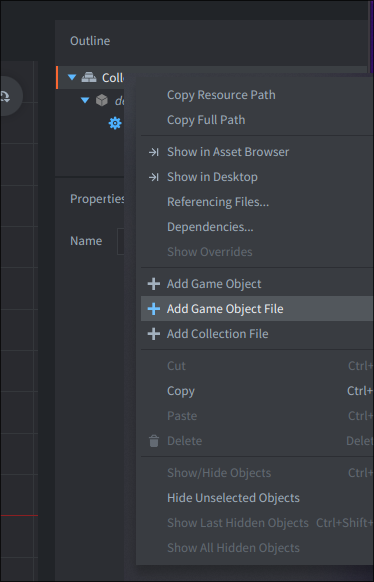
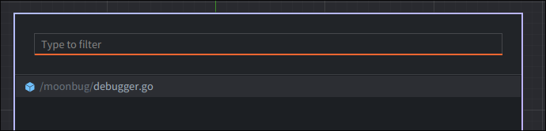

# Defold Moonbug

A Defold library that allows you to debug your games using editors supporting the [Debug Adapter Protocol](https://microsoft.github.io/debug-adapter-protocol/).

Please report issues at the main repository: [atomicptr/moonbug](https://github.com/atomicptr/moonbug)

## Editor Integrations

### Visual Studio Code

We have an official Visual Studio Code extension available here:

- Visual Studio Code Extension Store (coming soon...)
- [Github](https://github.com/atomicptr/vscode-moonbug)

## Installation

Open your `game.project` file and add the following line to your dependencies under the **Project** section:

```
https://github.com/atomicptr/defold-moonbug/archive/refs/heads/master.zip
```

After that, select **Project ▸ Fetch Libraries** to fetch & update your libraries.

Next in your primary collection (usually `main/main.collection`), right click the collection and hit **Add Game Object File**.



And now select the **\/moonbug\/debugger.go** file



## License

MIT
