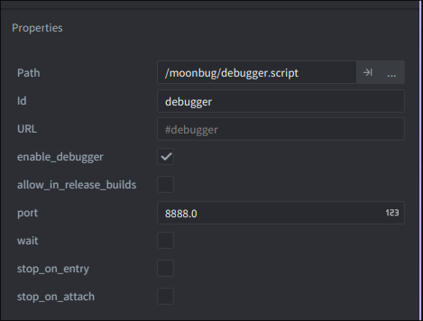

# Defold Moonbug


A Defold library that allows you to debug your games using editors supporting the [Debug Adapter Protocol](https://microsoft.github.io/debug-adapter-protocol/).

Please report issues at the main repository: [atomicptr/moonbug](https://github.com/atomicptr/moonbug)

## Editor Integrations

### Neovim

Requires you have [mfussenegger/nvim-dap](https://github.com/mfussenegger/nvim-dap) installed:

```lua
local dap = require "dap"

dap.configurations.lua = {
    {
        type = "moonbug",
        request = "attach",
        name = "moonbug",
        project_root_dir = "${workspaceFolder}",
    },
}

dap.adapters.moonbug = {
    id = "moonbug",
    type = "server",
    port = os.getenv "MOONBUG_PORT" or 8888,
}
```

### Visual Studio Code

We have an official Visual Studio Code extension available here:

- Visual Studio Code Extension Store (coming soon...)
- [Github](https://github.com/atomicptr/vscode-moonbug)

### Zed

We have an official Zed extension available here:

- Zed Extensions Repository (coming soon...)
- [Github](https://github.com/atomicptr/zed-moonbug)

## Installation

Open your `game.project` file and add the following line to your dependencies under the **Project** section:

```
https://github.com/atomicptr/defold-moonbug/archive/refs/heads/master.zip
```

After that, select **Project ▸ Fetch Libraries** to fetch & update your libraries.

Next in your primary collection (usually `main/main.collection`), right click the collection and hit **Add Game Object File**.


And now select the **\/moonbug\/debugger.go** file


The debugger gets loaded automatically unless you disable the `enable_debugger` property. You can enable the debugger at runtime via sending a message, see below.



**Note**: The debugger is automatically disabled in `release` builds unless you explicitly tick the `allow_in_release_builds` property OR you send a message to the debugger like this:

```lua
msg.post("/debugger", "enable_debugger")
```

## License

MIT
